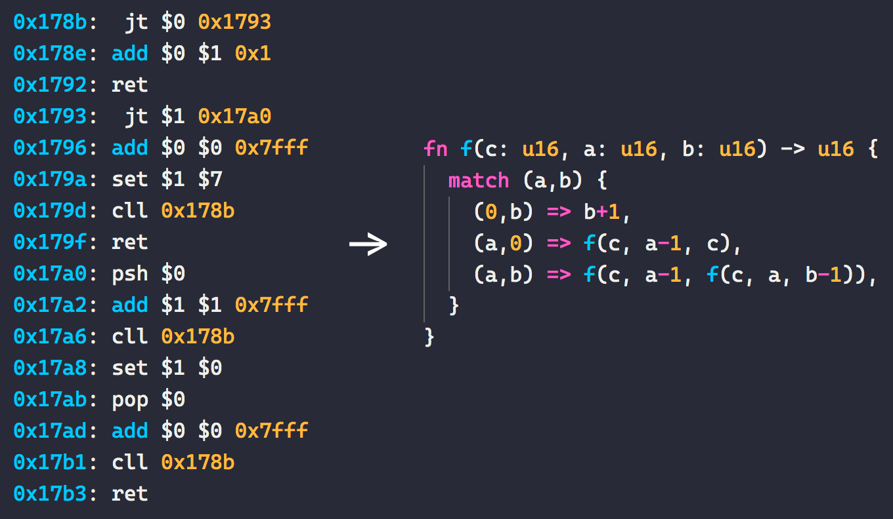
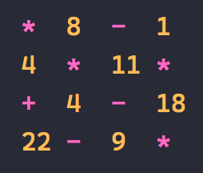
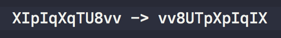

# Synacor Challenge
Solution to the [Synacor Challenge](https://challenge.synacor.com/) in Rust. Thanks [@ericwastl](https://twitter.com/ericwastl) for a super cool challenge!

:warning: Spoilers in the next section. Avoid reading the section below unless you want the challenge spoiled. :warning:

# Usage
- To run through the entire challenge: `cargo run --release`.
- To play the text adventure game manually: `cargo run --release -- manual`
- To run any of the [separate programs](./src/bin) I created to solve the challenge: `cargo run --release --bin PROGRAM`

# Solution write up
This section is a write up of the steps I took to solve the challenge and the different strategies I applied along the way, as well as what strategies failed. The challenge was to find all the 8 codes hidden throughout the game and behind the puzzles.

## 1. Build the VM
Starting the challenge, you are given just a binary file and a specification of a custom CPU architecture. So the first step is to build a VM that can run this binary. Not too many issues here. Took me maybe 2-3 hours with some debugging to get it passing the self test. Having just finished [Advent of Code 2019](https://github.com/AxlLind/AdventOfCode2019/) certainly helped here. I could reuse a lot of the patterns I used for the [IntCoder](https://github.com/AxlLind/AdventOfCode2019/blob/master/src/intcoder.rs) VM in those puzzles. **Code 1-3/8 done!** I think my implementation ended up quite clean:

See [cpu.rs](./src/cpu.rs).

## 2. Manually explore
When you get the VM up and running you are presented with a text adventure game. I started by manually exploring the game and immediately you find the fourth code. Eventually, after some frustration in the maze, you find a can. This enables you to light the lantern and enter the dark part where you find another code. **Code 4-5/8 done!**

I started writing down the commands I did and automatically feeding it to the CPU at the start of the program. This meant I did not have to replay the beginning all the time. I continued adding to this list of inputs as I progressed through the challenge. Manually exploring the game worked up until you encounter the locked door.

See [inputs.txt](./files/inputs.txt).

## 3. Brute forcing coin order
After exploring the game you end up with 5 coins at a locked door. You need to place them in the correct order to unlock it. The description of the coins gives hints to their value and the door gives you the following equation:

So the puzzle is clearly to satisfy the equation with the order we place the coins, given their respective value. With 5 coins there are `5! = 120` permutations. Too much to check by hand but trivially brute-forced by a computer. I wrote a program to just test all permutations of coins and output commands that places them in the correct order. With that, the door unlocks and behind it you find a teleporter. Using the teleporter, you get an other code but you end up at a dead-end... **Code 6/8 done!**

See [solve_coins.rs](./src/bin/solve_coins.rs).

## 4. Finding the teleporter setting
After using the teleporter you find a book in the next room. Using the teleporter leads to a dead-end but the book hints that register `$7` is unused in the program except for when the teleporter is used. So we need to find the correct value for the register so that the teleporter takes us to the next place we want to go.

### 4.1 Try brute force?
Why make things complicated? Always try the easiest solution first. Unfortunately, brute-forcing the register value does not work. The program performs some expensive computation for all non-zero values of register `$7`. Each computation takes minutes to complete so brute-forcing `0x8000` values will not work. We need to be able to analyze what the program does. So this lead me to the next step.

### 4.2 Build a disassembler
I needed to be able to analyze what the program actually does so disassembling the binary seemed like the best solution. Building a basic disassembler was fairly straight forward. You just have to step through the binary and print the corresponding instructions in a readable form. The majority of the binary does not contain machine code though. It presumably contains encrypted data that can only be decrypted by solving the puzzles.

See [disassembler.rs](./src/bin/disassembler.rs) and the [disassembled program](./files/disassembled.asm).

### 4.3 Analyze the assembly
Looking at the assembly we see that register `$7` only shows up a few times. First is in the test suite, at `0x0209`, where they just check that it is set to zero. We can easily just remove this instruction (e.g replace it with `nop`), otherwise, we do not pass the test suite when we try different values for `$7`. Secondly, we see it at address `0x154b` in a `jf` instruction. If the register is zero it jumps, so clearly this must be where the teleporter code is! Lastly, we also see `$7` used at a function at the address `0x178b`. After some analysis of the assembly code, you realize that this is where the expensive computation takes place.

### 4.4 Just disable the expensive function?
My first idea was to just remove the call to the expensive function. The program checks that it returns `6` so I removed that check as well. This *sort of* works. The teleporter now teleports to a new place and a code is printed! Unfortunately, the code is not accepted by the website. So, I could technically go forward and solve the next puzzle but that would not be completing the challenge. It seems the value of `$7` is used when decrypting the code so we still have some work to do. We need to find a value for the register such that the function returns 6.

### 4.5 Porting the expensive function to Rust
To be able to find input such that the function returns `6` we need to be able to run it in Rust. After commentating the assembly and some careful analysis, I was able to port the expensive function to Rust. It looks like an [Ackermann](https://en.wikipedia.org/wiki/Ackermann_function)-style function, meaning it has a very large recursive depth and can be incredibly expensive to compute.

Just calling the function is way to slow even in Rust so we need to make some optimizations. My first idea was to just try memoizing the function. This actually makes it fast enough to get an answer within a reasonable amount of time! We see that the value of the first parameter never increases. This means the total number of possible inputs `(a,b)` is relatively small, given our starting parameters `(4,1)`. Parameter `a` can only take on the values `0-4` and `b` only `0-0xFFFF`, giving a total of `327 675` possible inputs. So we can use an array as a very fast memoization cache. This turned out to be about an **8x** speed up compared to using a HashMap as a cache. Lastly, we can note some [mathematical relations in the Ackermann function](https://archive.lib.msu.edu/crcmath/math/math/a/a044.htm) that apply to `f(1,b)` and `f(2,b)` that gave a further **5x** speed up. With these optimizations, we can find the correct value in about 10 seconds, good enough!

With the correct value set in register `$7`, I disabled the code that runs the expensive function, as well as the check in the test suite, by replacing it with `nop` instructions. The teleporter now teleports to a different place and the code works, phew! **Code 7/8 done!**

See [teleporter_setting.rs](./src/bin/teleporter_setting.rs).

## 5. Solving the shortest path problem
After you use the teleporter you end up at a beach where you find a journal giving you some clues for the puzzle ahead. Further on you find a temple and an orb with the value `22` written on it. This temple contains rooms with either a number of a mathematical operation. So layed out the temple looks like this, with each room connected in the cardinal directions:

After exploring you see that the room in the 1 room leads to a vault but the door is locked. It gives a hint about the number `30`. So presumably the puzzle is to start with the value `22` and walk the maze, updating your current value with the corresponding operation and value. The goal is then to end up at the final room with a value of `30`, thus unlocking the door to the vault. The journal hints that you have a *short amount of time* to do this in, so presumably we need to find the shortest path. So, basically this is just a creative graph problem!

I translated the temple into a graph in Rust by hand. In hindsight was maybe a dumb idea. It turned out quite complicated since there are actually quite a few edges in this graph. I was very careful so I did not make any mistakes in the translation but it still took a while. A programmatic solution to generate the maze would have maybe been easier.

This is an unweighted graph, meaning [BFS](https://en.wikipedia.org/wiki/Breadth-first_search) will give us the shortest path. This is easier to implement than something like [Dijkstra's algorithm](https://en.wikipedia.org/wiki/Dijkstra%27s_algorithm), so that's what I used. The key idea was to realize that a vertex in the graph is a pair `(room,value)`, not just a `room`. With this, you can easily avoid infinite loops in the BFS while at the same time allowing you to visit a room more than once. The goal is then just the vertex `(1,30)` and your starting position `(22,22)`. This part was basically just a simple graph finding problem but still fun!

In the end, you walk into the vault and find a mirror. When you use the mirror it gives you the final code but when I gave it to the site it was incorrect! After a while, I figure out that it's a mirror so obviously the code is mirrored! I reverse the string but still it says it's incorrect. If you look at each letter carefully you notice that they are all symmetrical except for `p,q` which when mirrored become each other. So the translation becomes the following. **Code 8/8 done!**

See [maze_shortest_path.rs](./src/bin/maze_shortest_path.rs).

## Final thoughts
With that, I finished the challenge! I did it over 4 days and put maybe around 20 hours into it, including writing everything down. It was a lot of fun, especially the teleporter part which was easily the most challenging and rewarding programming puzzle I have ever done! It had me thinking about it all the time. You really had to get into the assembly and even disassemble it yourself. I would have liked to see more of that in the final challenge. That was an unrelated path-finding problem. A very creative one but still quite easy compared to what you did before. Amazing challenge nonetheless, probably the best one I've ever done.

I think my CPU implementation was quite efficient as well. I managed to do a single clean execute loop. It runs through the entire challenge, with my [inputs](./files/inputs.txt), in about 7 milliseconds.
