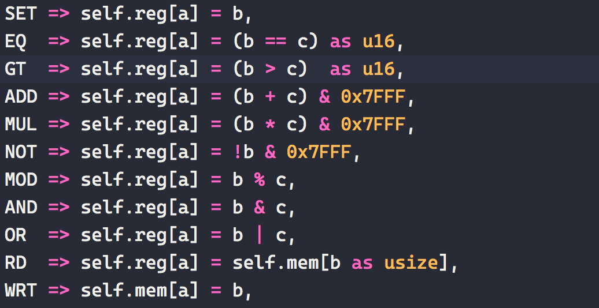
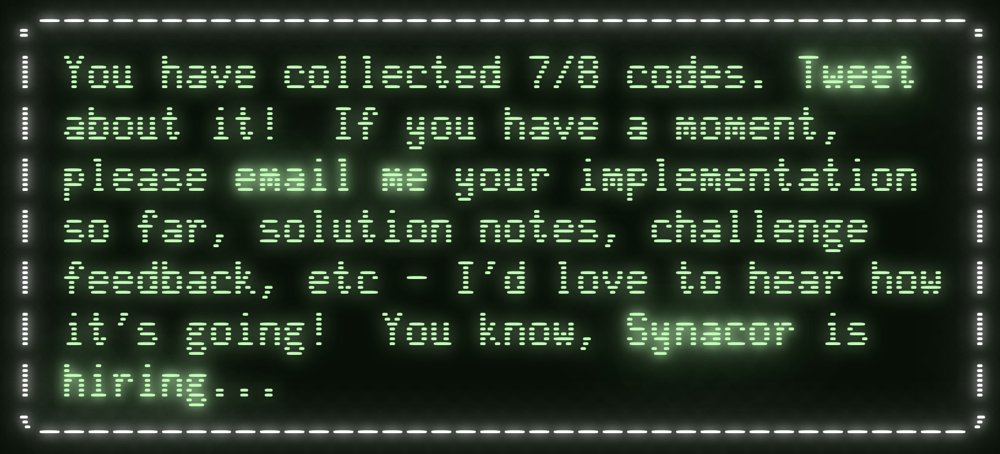
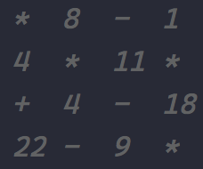
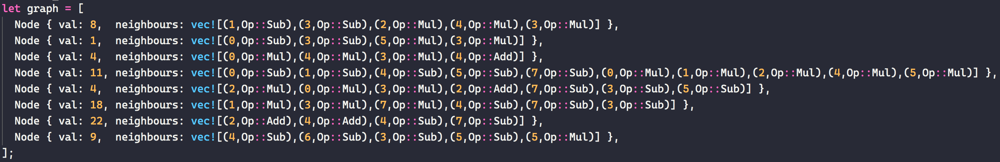

# Synacor Challenge
Solution to the [Synacor Challenge](https://challenge.synacor.com/) in Rust.

:warning: Spoilers in the next section. Avoid reading the section below unless you want the challenge spoiled.

## Approach
This section details roughly the steps I took to solve the challenge and the different strategies I applied along the way, as well as what strategies failed.

### 1. Build the VM
Not too much issue here, took maybe 2-3 hours with some debugging to get it working. Having done [Advent of Code 2019](https://github.com/AxlLind/AdventOfCode2019/) certainly helped here. I think my implementation ended up quite clean.

See [cpu.rs](./src/cpu.rs).

### 2. Manually explore
I started by manually exploring the game. Found the can after some frustration in the maze. Started writing down the commands I did and automatically feeding it to the CPU at the start of the program. This meant I did not have to replay the beginning all the time. Manually exploring worked up until you encounter the locked door.

See [inputs.txt](./inputs.txt).

### 3. Brute forcing coin order
After exploring the game you end up with 5 coins at a locked door. You need to place them in the correct order. The description of the coins gives hints to their value and the door gives you an equation.

So the puzzle is clearly to satisfy the equation with the order we place the coins, given their respective value. With 5 coins there are only `5! = 120` permutations to check so this can easily be brute forced.

See [solution here](./src/bin/solve_coins.rs).

### 4. Finding the teleporter setting
After the door unlocks we find a teleporter and a book in the next room. Using the teleporter takes you to a dead end. The book hints that register `$7` is unused in the program except for when the teleporter is used. So we need to find the correct value for the register so that the teleporter takes us to the place we want to go.

#### 4.1 Try brute force?
Why make things complicated? Always try the easiest solution first. Unfortunately, brute force does not work. The program performs some expensive computation for all non-zero values of `$7`. Each computation takes minutes so brute forcing `0x8000` values will not work. We need to be able to see what the program actually does. So this lead me to the next step.

#### 4.2 Build a disassembler
Building a basic disassembler was was fairly straight forward. You just have to step through the binary and print the corresponding instructions in a readable form. A large part of the binary does not seem to contain machine code though, which tripped me up for a bit.

See [disassembler.rs](./src/bin/disassembler.rs) and the [disassembled program](./disassembled.asm).

#### 4.3 Analyze the assembly
Looking at the assembly we see that register `$7` only shows up a few times. First is in the test suite, at `0x0209`, where they just check that it is set to zero. This we can easily just remove this instruction (e.g replace it with `nop`), otherwise we do not pass the test suite when we try different values for `$7`. Secondly, we see it at address `0x154b` in a `jf` instruction. If the register is zero it jumps, so this is clearly where the teleporter code is! Lastly, we also see `$7` at the very end of the binary, at a function at adr `0x178b`. After some analysis of the assembly code, you realize that this is clearly where the expensive computation takes place.

#### 4.4 Just disable the expensive function?
My first idea was to just remove the call to the expensive function. The program checks that it returns `6` so I removed that check as well. This *sort of* works. The teleporter now teleports to a new place and a code is printed! Unfortunately, the code is not accepted by the website. It seems the value of `$7` is used when decrypting the code so we still have some work to do. We need to find a value for the register such that the function returns 6.

#### 4.5 Porting the expensive function to Rust
After some comments in the assembly and analysis, I was able to port the expensive function to Rust. It looks like an [Ackermann](https://en.wikipedia.org/wiki/Ackermann_function)-style function, meaning it has a very deep recursive depth and is very expensive to compute. Just calling the function is way to slow even in Rust. Memoizing it though makes it quick enough to get an answer within a reasonable amount of time! Still slow but I am able to find the correct value in about 7 minutes. Code 7/8 done!

See [teleporter_setting.rs](./src/bin/teleporter_setting.rs).

### 5. Solving the shortest path problem
After you use the teleporter you end up at a beach. Walking north you end up at a temple. To the east you also find a journal giving you some clues for the puzzle ahead. By the temple is an orb with the value `22` written on it. Each room in the temple has something written on it. The temple looks like this:

After exploring you see that the square in the top right corner leads to a vault but the door is locked. It gives a hint about the number `30`. So I presume the puzzle is to start at the value 22 and walk the maze and updating your current value with the corresponding operation and value. With the goal being to end up at the final square with a value of 30. The journal hints that you have few moves to do this in so presumably we need to find the shortest path.

I translated the maze into Rust by hand. In hindsight was maybe a dumb idea. It turned out quite complicated since there are actually quite a few edges in this graph. I was very careful so I did not make any mistakes in the translation but it still took a while. A programmatic solution to generate the maze would have maybe been easier.

This is of course an unweighted graph. This means [BFS](https://en.wikipedia.org/wiki/Breadth-first_search) will give us the shortest path, which is obviously easier to implement than something like [Dijkstra's algorithm](`https://en.wikipedia.org/wiki/Dijkstra%27s_algorithm`). The key idea was to consider your current state as `(place,score)`, not just `place`. With this you can easily avoid infinite loops in the BFS while at the same time allowing you to visit a room more than once. The goal is then just the state `(1,30)` and your starting position `(22,22)`.

This part was basically just a simple graph finding problem but still fun! The previous part was much, much more challenging.

See [maze_shortest_path.rs](./src/bin/maze_shortest_path.rs).

### Final thoughs
With that I finished the challenge. I did it over the course of 3 days and put maybe around 20 hours into it. It was a lot of fun, especially the teleporter part. You really had to get into the assembly and even disassemble it yourself. That part was really cool!

Thanks [@ericwastl](https://twitter.com/ericwastl) for a supercool challenge!
